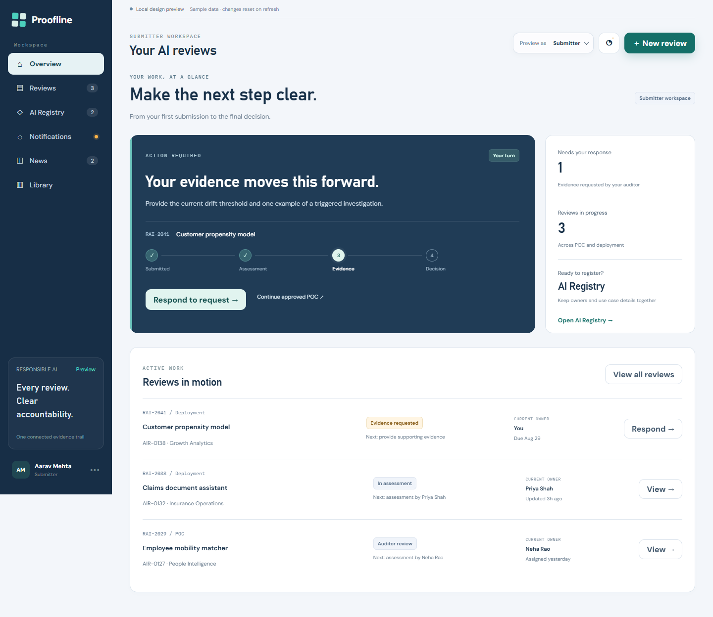
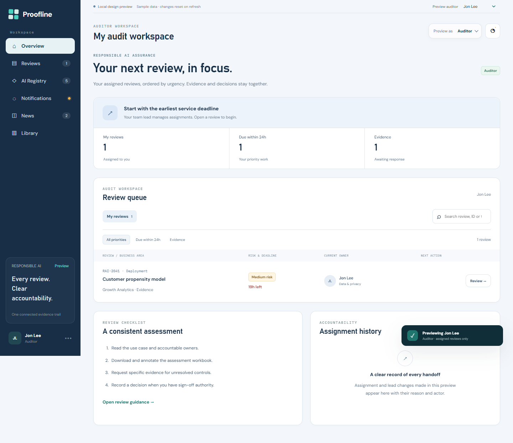
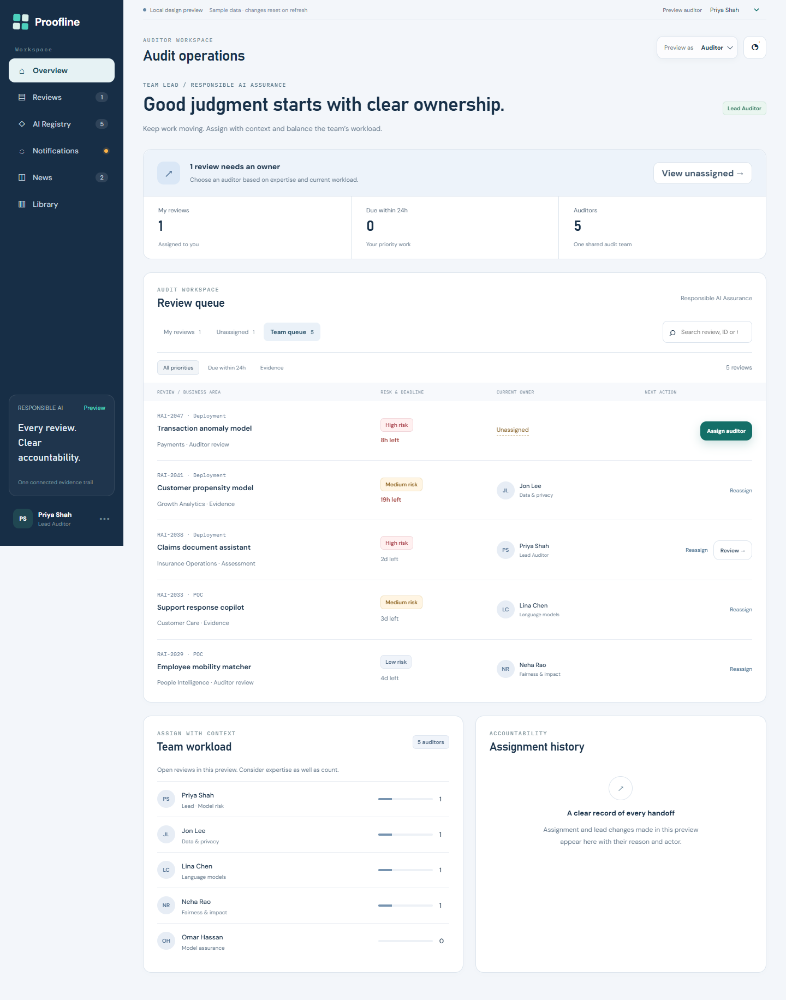
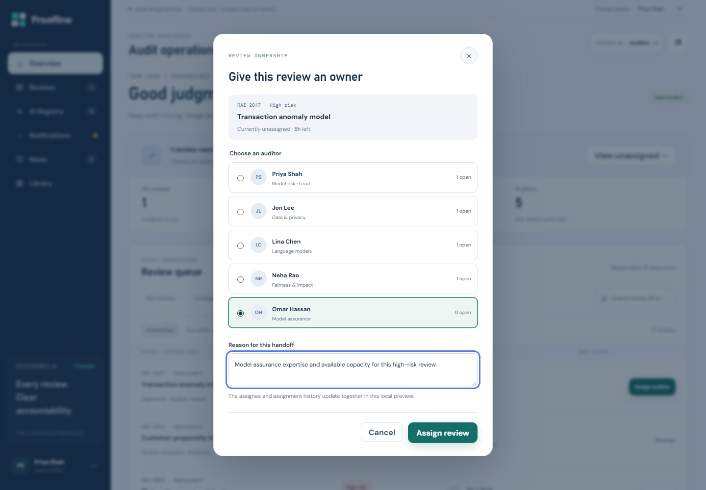
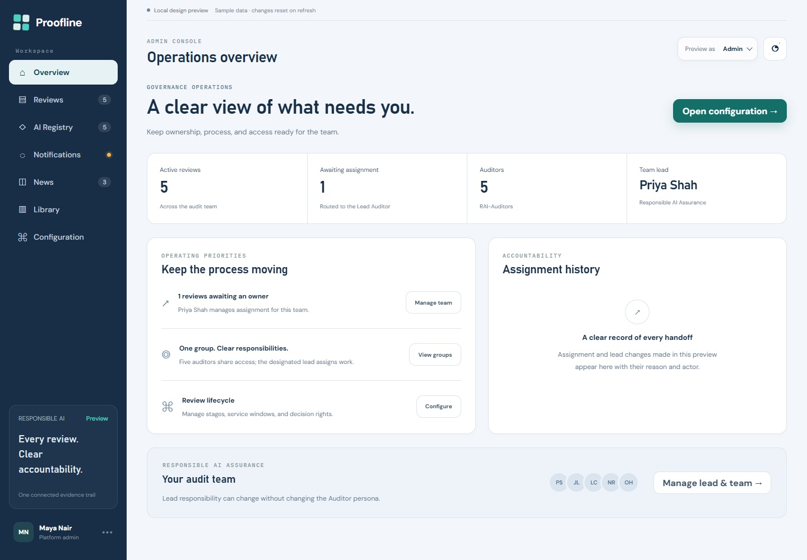
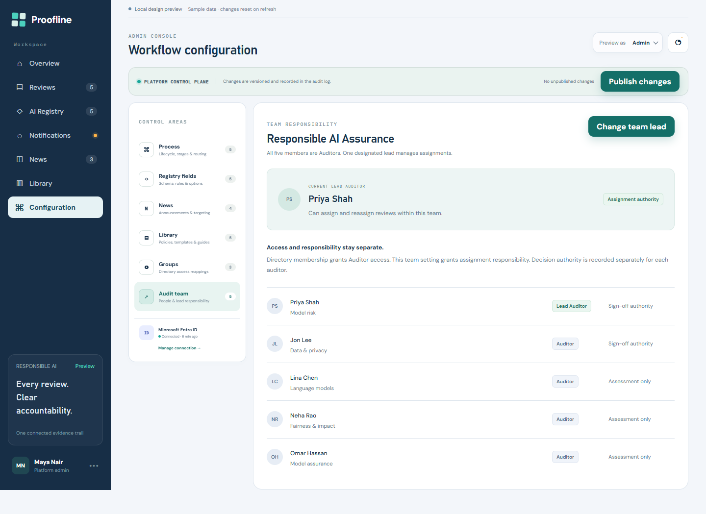
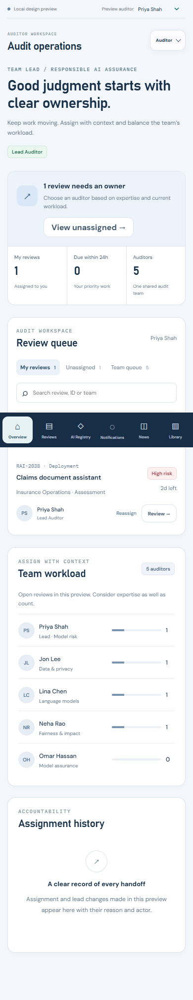

# Proofline v2 — Responsible AI workspaces

Proofline is an interactive prototype for managing responsible AI reviews from
registration through assessment, evidence collection, and decision. Version 2
makes the next action and current owner clear for **Submitters, Auditors, and
Admins**, with a working team lead assignment flow.

This version lives on **`codex/v2-persona-experience`**. It is maintained separately
from `main`.

## What's new in version 2

- An action-focused Submitter overview with current ownership and review progress.
- An evidence response dialog that updates the existing review.
- Personal audit queues, search, priority filters, and useful empty states.
- A Lead Auditor workspace with unassigned work, team queues, and workload.
- Assignment and reassignment with an explicit recipient, reason, and history.
- An Admin operations overview and team lead management.
- Separate assessment, assignment, and sign-off capabilities in the preview.
- Notifications for handoffs, evidence responses, and completed decisions.
- A refreshed visual system, mobile navigation, visible keyboard focus, and
  accessible assignment dialogs.

## Persona workspaces

### Submitter — see and complete your next action

See which review needs a response, who owns the current step, and where each
submission sits in the review journey. Respond to an evidence request without
creating a second review, or start a review from a registered AI use case.



### Auditor — focus on assigned reviews

An ordinary auditor sees their own queue, with search and filters for urgency
and evidence. Review details connect the assessment workbook, evidence response,
and next action. Assessment-only auditors can request evidence; sign-off requires
separate decision authority.



### Lead Auditor — manage ownership within the same persona

The lead is one of the five Auditors, with additional responsibility for team
assignments. Switch between **My reviews**, **Unassigned**, and **Team queue**.
Workload reflects the open reviews in the preview.



Assign or reassign a review by selecting a colleague and recording the reason.
The assignee's queue, workload, notifications, and assignment history update
together.



### Admin — oversee operations and designate the lead

The operations overview highlights reviews awaiting ownership and provides
direct access to team settings, directory mappings, and workflow configuration.



In **Configuration → Audit team**, Admin can replace the Lead Auditor with another
team member. The previous lead retains their Auditor access and assigned reviews
but loses assignment controls. Sign-off authority remains separate.



<details>
<summary>Mobile Auditor workspace</summary>

The same workflows adapt to a narrow screen, with compact review cards and bottom
navigation.



</details>

## Three groups, one team lead responsibility

| Directory group | Persona | Preview behavior |
|---|---|---|
| `RAI-Admins` | Admin | Manage configuration, access mappings, and team lead designation |
| `RAI-Auditors` | Auditor | Assess assigned reviews; the designated team lead additionally assigns work |
| `RAI-Submitters` | Submitter | Register use cases, submit reviews, and respond to evidence requests |

The sample audit team contains **Priya Shah, Jon Lee, Lina Chen, Neha Rao, and Omar
Hassan**. Priya starts as the Lead Auditor. Lead responsibility is an
application-managed team setting, not a fourth persona or a separate required
directory group.

The [backend blueprint](Backend/README.md#10-identity-and-authorization) defines
the production authorization model, data entities, API contracts, revocation
rules, and acceptance criteria.

## Run locally

No build step or package installation is required. From the repository root:

```powershell
py -m http.server 4173 --bind 127.0.0.1
```

Open [the local preview](http://127.0.0.1:4173). Direct routes:

- [Submitter overview](http://127.0.0.1:4173/?role=user)
- [Auditor workspace](http://127.0.0.1:4173/?role=auditor)
- [Admin operations](http://127.0.0.1:4173/?role=admin)
- [Admin audit team](http://127.0.0.1:4173/?role=admin&page=configuration&adminTab=teams)
- [Admin Registry configuration](http://127.0.0.1:4173/?role=admin&page=configuration&adminTab=registry)

## Try the version 2 flow

Keep the same browser tab so the in-memory changes carry across persona switches.

1. Choose **Preview as → Auditor**. Priya Shah starts as Lead Auditor.
2. Open **Unassigned → Assign auditor**, select Omar Hassan, and add a handoff
   reason. Confirm the assignment and inspect the updated workload/history.
3. Use **Preview auditor** to select Omar. The review appears in his personal
   queue; assignment controls are unavailable.
4. Choose **Preview as → Admin → Manage team → Change team lead**. Select Jon Lee
   and save a reason.
5. Return to **Auditor**. Preview Priya and Jon to compare their controls:
   Jon now manages assignments; Priya remains an Auditor.
6. Choose **Submitter**, open the pending evidence request, and send a response.
   The existing review returns to assessment without creating another review.
7. Return to **Auditor** and preview Jon to inspect the response. Upload a reviewed
   workbook before requesting more evidence or exercising his sign-off authority.

To explore the original submission flow, register or select an AI use case,
choose POC or Deployment, and supply a workbook. New reviews enter the unassigned
queue for the Lead Auditor.

## Other supported prototype workflows

- Version-aware lifecycle stages, routing, service windows, and decision rights.
- AI Registry fields, required-state rules, lifecycle choices, and owner pickers.
- Deployment reviews continued from an approved POC.
- News and Library content, attachments, and audience targeting.
- Directory-backed role and scope mappings, with directory membership read-only.
- Review search, notifications, and persona-specific content views.

## Verification

The local browser checks covered assignment/reassignment, lead replacement,
ordinary auditor restrictions, sign-off authority, evidence response, and new
submission routing. They also checked search/empty states, dialog keyboard focus,
and navigation for all three personas at desktop and 390/768/1024-pixel widths.
JavaScript syntax and Git whitespace checks passed.

Screenshots in this README were captured from the version 2 local UI using sample
data. Older screenshots remain in `docs/assets/`; this tour uses only
`docs/assets/v2/`.

## Project structure

```text
index.html                  Application shell and persona views
styles.css                  Original visual system and shared components
app.js                      Prototype state and workflow integration
experience.js               Persona queues, assignments, lead management, evidence
experience.css              Version 2 workspace and responsive styles
sample-reviewed-workbook.csv
Backend/README.md           Production backend blueprint
docs/assets/v2/             Version 2 README screenshots
```

The local `template/` source-material folder and `.edge-qa/` verification artifacts
are excluded from version control.

## Prototype boundaries

The role/person selectors simulate identities for design review. All changes
live in memory and reset on refresh; different tabs do not share state.

Files, directory synchronization, workbook validation, and notifications are
prototype behavior. Evidence responses retain text and file metadata in memory;
files are not uploaded to a production evidence store. UI capability checks
demonstrate the intended interaction and are not a security boundary.

Production persistence, authentication, file scanning, and authorization on
every API request remain defined by the backend blueprint.
