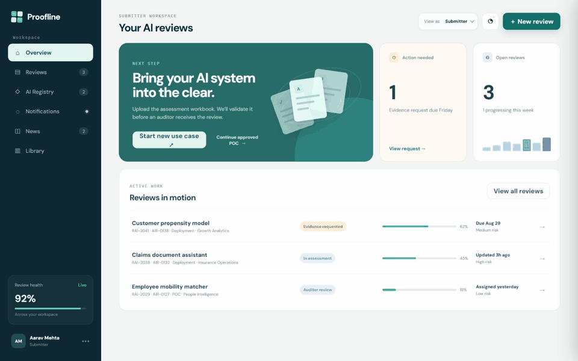
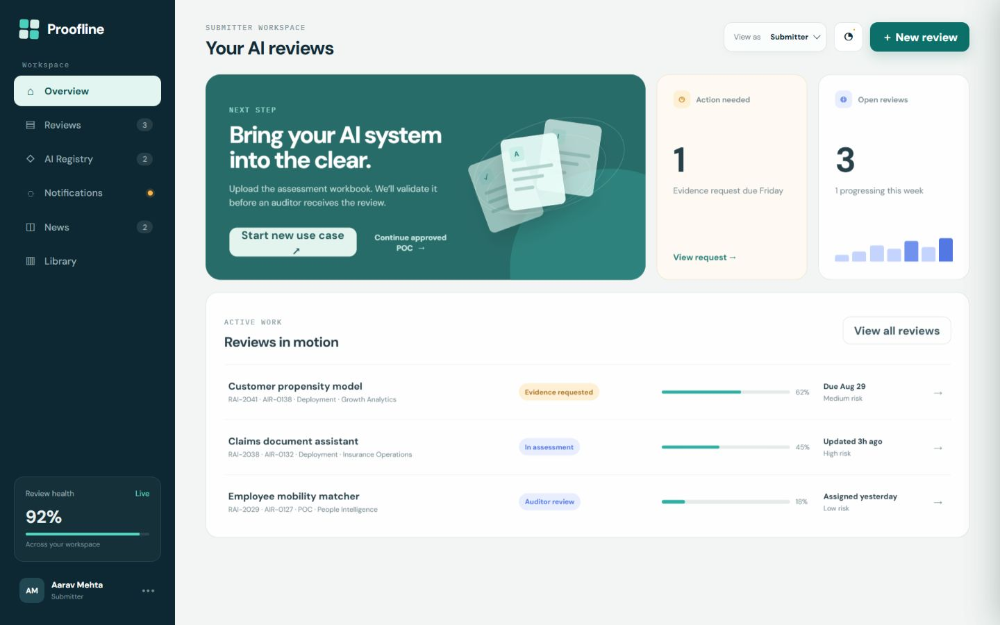
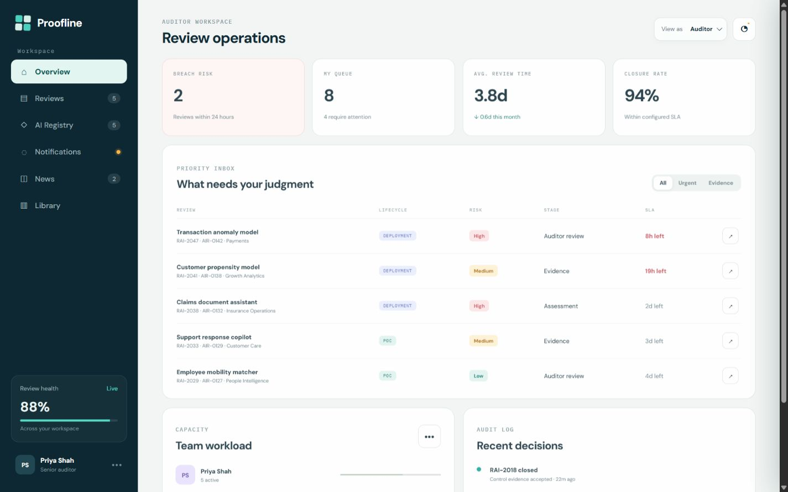
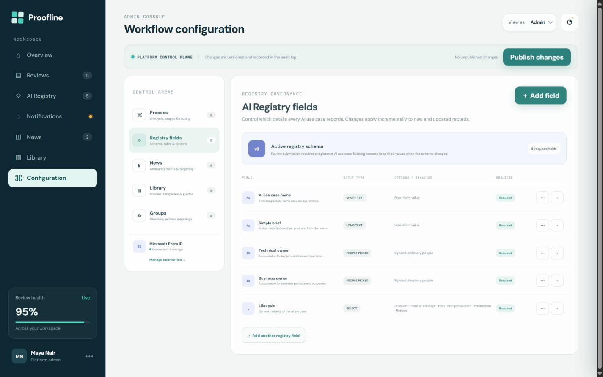

# Proofline — Responsible AI operations

Proofline is a high-fidelity, interactive prototype for managing responsible AI reviews from registration through audit closure. It brings submitters, auditors, and platform administrators into one governed workspace while keeping process configuration, communications, resources, and directory-backed access under Admin control.



## Persona workspaces

### Submitter

Register an AI use case, start a POC or deployment review, upload the assessment workbook, respond to evidence requests, and track progress from one workspace. A review cannot be submitted until a ready AI Registry record is selected.



### Auditor

Prioritize work by risk and SLA, inspect registered use cases, download and return reviewed workbooks, request evidence, sign off decisions, and access targeted News and Library content.



### Admin

Manage the platform's operating model without changing application code: lifecycle stages, timelines, routing, decision rights, AI Registry fields and options, News, Library resources, and organizational group mappings.



## Core capabilities

- Configurable lifecycle stages, owners, decision rights, timelines, routing, and notifications
- Version-aware Admin control plane with publish-state feedback
- AI Registry with configurable fields, required-state rules, lifecycle options, and directory people pickers
- Submission gate that requires a ready Registry record and validated workbook
- POC and deployment paths, including continuation from an approved POC baseline
- Auditor queue with risk, SLA, evidence, review, and sign-off interactions
- Targeted News with statements, image attachments, and document attachments
- Governed Library with external links and direct file uploads
- Role-aware News and Library previews for Submitters and Auditors
- Microsoft Entra ID and AWS IAM Identity Center-style group mappings, with membership kept read-only in the platform
- Themed accessible dropdowns across static and dynamically rendered forms
- Responsive persona layouts for desktop, compact browser panels, and mobile-width previews

## Run locally

No build step or package installation is required.

```powershell
py -m http.server 4173
```

Open [http://localhost:4173](http://localhost:4173). Useful direct routes include:

- Submitter: `http://localhost:4173/?role=user`
- Auditor: `http://localhost:4173/?role=auditor`
- Admin Registry controls: `http://localhost:4173/?role=admin&page=configuration&adminTab=registry`

## Try the governed flow

1. Switch to **Admin** and open **Configuration → Registry fields** to add, edit, remove, or reorder field options.
2. Open **News**, **Library**, or **Groups** to manage targeted content and directory mappings.
3. Switch to **Submitter**, open **AI Registry**, and create or update a use case.
4. Select **New review**. The action remains blocked until a ready Registry record and a valid `.xlsx`, `.xls`, or `.csv` workbook are supplied.
5. Switch to **Auditor**, open a queued review, upload the reviewed workbook, and complete an evidence or sign-off decision.

## Project structure

```text
index.html                 Application shell and persona views
styles.css                 Visual system, components, and responsive layouts
app.js                     Prototype state and interactions
sample-reviewed-workbook.csv
docs/assets/               README screenshots and persona animation
```

The local `template/` source-material folder is intentionally excluded from version control.

## Prototype note

This repository is a frontend prototype with in-memory data. The Admin UX is structured for a future backend and cloud integration where published configuration, attachment storage, audit history, and Entra ID or AWS IAM Identity Center mappings would be persisted through governed APIs.
